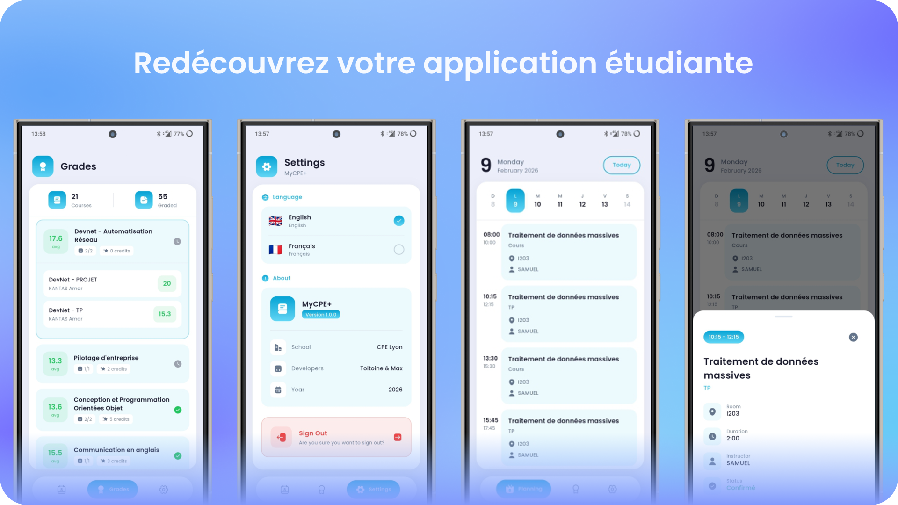

# MyCPE Plus



**[English](#english) | [Français](#français)**

---

## English

### Overview

An enhanced student portal application for CPE Lyon, providing streamlined access to grades, schedules, and academic information.

### Description

MyCPE Plus is a modern mobile application designed specifically for CPE Lyon students. The application offers a clean and intuitive interface to access essential academic services. Students can view their grades in real-time, consult their class schedules, and manage their academic planning through a unified platform. The application securely stores authentication credentials and provides a smooth user experience optimized for mobile devices.

Built with Flutter, MyCPE Plus delivers native performance across iOS and Android platforms while maintaining a consistent user experience. The application implements secure token-based authentication and encrypted local storage to protect sensitive student data. The interface follows modern design principles with support for both light and dark themes.

### Tech Stack

- **Framework**: Flutter 3.10.7
- **Language**: Dart

### Project Setup

#### Prerequisites

- Flutter SDK 3.10.7 or higher
- Dart SDK (included with Flutter)
- Android Studio / Xcode (for mobile development)
- Git

#### Installation

1. Clone the repository
```bash
git clone https://github.com/toinoux38/MyCPE-Plus.git
cd mycpe_plus
```

2. Install dependencies
```bash
flutter pub get
```

3. Run the application
```bash
# Development mode
flutter run

# Specific device
flutter run -d <device_id>

# Release mode (Android)
flutter run --release
```

#### Available Commands

```bash
# Check for dependency updates
flutter pub outdated

# Analyze code
flutter analyze

# Run tests
flutter test

# Build release APK (Android)
flutter build apk --release

# Build release app bundle (Android)
flutter build appbundle --release

# Build iOS (requires macOS)
flutter build ios --release
```

### Project Structure

```
lib/
├── core/
│   ├── constants/     # App constants and configuration
│   ├── localization/  # Internationalization files
│   ├── theme/         # App theme and styling
│   └── utils/         # Utility functions
├── data/
│   ├── models/        # Data models
│   └── services/      # API and business logic services
├── providers/         # State management providers
└── ui/
    ├── screens/       # Application screens
    └── widgets/       # Reusable UI components
```

### Play Store (SOON)


MyCPE Plus is your enhanced student portal for CPE Lyon. Access your grades instantly, check your schedule at a glance, and stay on top of your academic planning. Designed with students in mind, the app provides a clean interface to manage your academic life efficiently. View real-time grade updates, browse your course schedule by day or week, and keep track of important academic deadlines. MyCPE Plus transforms your CPE Lyon student experience with an intuitive mobile interface that puts all your essential academic information right at your fingertips.

---

## Français

### Aperçu

Une application améliorée du portail étudiant pour CPE Lyon, offrant un accès simplifié aux notes, emplois du temps et informations académiques.

### Description

MyCPE Plus est une application mobile moderne conçue spécifiquement pour les étudiants de CPE Lyon. L'application offre une interface claire et intuitive pour accéder aux services académiques essentiels. Les étudiants peuvent consulter leurs notes en temps réel, visualiser leurs emplois du temps, et gérer leur planification académique à travers une plateforme unifiée. L'application stocke de manière sécurisée les identifiants d'authentification et offre une expérience utilisateur fluide optimisée pour les appareils mobiles.

Développée avec Flutter, MyCPE Plus offre des performances natives sur les plateformes iOS et Android tout en maintenant une expérience utilisateur cohérente. L'application implémente une authentification sécurisée par jeton et un stockage local chiffré pour protéger les données sensibles des étudiants. L'interface suit les principes de conception modernes avec prise en charge des thèmes clair et sombre.

### Stack Technique

- **Framework** : Flutter 3.10.7
- **Langage** : Dart
- **Gestion d'état** : Provider
- **Composants UI** : Material Design, Cupertino Icons, Iconsax Flutter
- **Typographie** : Google Fonts (Poppins)
- **Réseau** : Client HTTP pour communication API REST
- **Sécurité** : Flutter Secure Storage pour stockage chiffré des jetons
- **Internationalisation** : Package Intl pour formatage des dates
- **Développement** : Flutter Lints pour la qualité du code

### Configuration du Projet

#### Prérequis

- Flutter SDK 3.10.7 ou supérieur
- Dart SDK (inclus avec Flutter)
- Android Studio / Xcode (pour le développement mobile)
- Git

#### Installation

1. Cloner le dépôt
```bash
git clone https://github.com/yourusername/mycpe_plus.git
cd mycpe_plus
```

2. Installer les dépendances
```bash
flutter pub get
```

3. Configurer la signature Android (optionnel, pour builds de production)
```bash
cp android/key.properties.template android/key.properties
# Éditer android/key.properties avec les informations de votre keystore
```

4. Lancer l'application
```bash
# Mode développement
flutter run

# Appareil spécifique
flutter run -d <device_id>

# Mode release (Android)
flutter run --release
```

#### Commandes Disponibles

```bash
# Vérifier les mises à jour de dépendances
flutter pub outdated

# Analyser le code
flutter analyze

# Exécuter les tests
flutter test

# Construire l'APK de production (Android)
flutter build apk --release

# Construire l'app bundle de production (Android)
flutter build appbundle --release

# Construire pour iOS (nécessite macOS)
flutter build ios --release
```

### Structure du Projet

```
lib/
├── core/
│   ├── constants/     # Constantes et configuration
│   ├── localization/  # Fichiers d'internationalisation
│   ├── theme/         # Thème et styles de l'application
│   └── utils/         # Fonctions utilitaires
├── data/
│   ├── models/        # Modèles de données
│   └── services/      # Services API et logique métier
├── providers/         # Providers de gestion d'état
└── ui/
    ├── screens/       # Écrans de l'application
    └── widgets/       # Composants UI réutilisables
```

### Description Play Store

MyCPE Plus est votre portail étudiant amélioré pour CPE Lyon. Accédez instantanément à vos notes, consultez votre emploi du temps en un coup d'œil et gérez votre planification académique. Conçue pour les étudiants, l'application offre une interface claire pour gérer efficacement votre vie académique. Visualisez les mises à jour de notes en temps réel, parcourez votre emploi du temps par jour ou par semaine, et suivez les échéances académiques importantes. MyCPE Plus transforme votre expérience étudiante à CPE Lyon avec une interface mobile intuitive qui met toutes vos informations académiques essentielles à portée de main.
